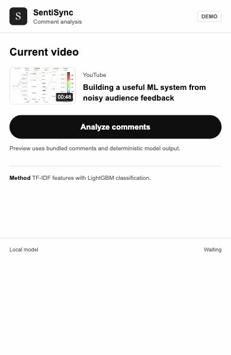
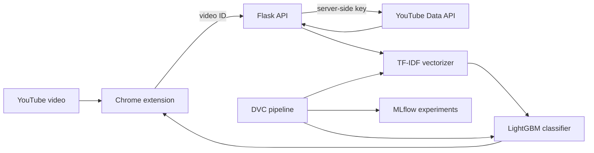

# SentiSync

Comment intelligence for YouTube, built as a Chrome extension backed by a reproducible TF-IDF and LightGBM pipeline.

[](https://github.com/ethanvillalovoz/sentisync/actions/workflows/ci.yml)
[](https://www.python.org/)
[](LICENSE)

<p align="center">
  
</p>

## Product

SentiSync turns a noisy comment section into three inspectable signals: sentiment distribution, conversation trend, and representative comments. The extension is intentionally compact, keeps raw text visible, and labels its deterministic demo separately from live inference.

The YouTube API key stays on the Flask server. The extension sends only a validated video ID, receives normalized comment records, and then requests predictions from the included model artifacts.

## Architecture



| Surface | Responsibility |
| --- | --- |
| Chrome extension | Current-tab detection, analysis workflow, safe DOM rendering, and visual summaries |
| Flask API | Input limits, comment retrieval, preprocessing, inference, and legacy chart endpoints |
| DVC | Deterministic data ingestion, preprocessing, model training, evaluation, and registration |
| MLflow | Experiment parameters, metrics, model signatures, and comparison artifacts |

## Preview The Product

The static preview requires no API key or model runtime:

```bash
python -m http.server 3000 --directory yt-chrome-plugin-frontend
```

Open [http://localhost:3000/popup.html?demo=1](http://localhost:3000/popup.html?demo=1). Demo responses are bundled fixtures and are visibly labeled as such.

## Run Live Analysis

### 1. Start The API

```bash
cp .env.example .env
python3.12 -m venv .venv
source .venv/bin/activate
pip install -r requirements-api.txt
python -m nltk.downloader stopwords wordnet
python flask_app/app.py
```

Set `YOUTUBE_API_KEY` in `.env`. On macOS, LightGBM also needs OpenMP:

```bash
brew install libomp
```

The API runs at [http://localhost:8080](http://localhost:8080) and exposes a machine-readable health check at `/health`.

### 2. Load The Extension

1. Open `chrome://extensions` and enable Developer Mode.
2. Select **Load unpacked** and choose `yt-chrome-plugin-frontend/`.
3. Copy the generated extension ID.
4. Add `chrome-extension://<extension-id>` to `SENTISYNC_ALLOWED_ORIGINS` and restart the API.
5. Open a standard YouTube watch page and launch SentiSync.

For a remote API, update `API_URL` in `yt-chrome-plugin-frontend/config.js` and add that origin to `host_permissions` in `manifest.json` before loading the extension.

## API Contract

| Endpoint | Method | Purpose |
| --- | --- | --- |
| `/health` | `GET` | Service health without loading model artifacts |
| `/youtube/comments` | `POST` | Retrieve at most 500 comments with a server-side API key |
| `/predict` | `POST` | Classify a bounded list of comment strings |
| `/predict_with_timestamps` | `POST` | Preserve timestamps and author identifiers during inference |
| `/generate_chart` | `POST` | Return a sentiment distribution PNG |
| `/generate_wordcloud` | `POST` | Return a preprocessed word-cloud PNG |
| `/generate_trend_graph` | `POST` | Return an aggregate sentiment trend PNG |

Requests are limited to 1 MB, comment batches to 500 items, and individual comments to 2,000 characters. Public errors do not expose model paths, API responses, or stack traces.

## Reproduce The Model

```bash
pip install -r requirements.txt
dvc repro
dvc dag
```

The pipeline downloads a labeled Reddit sentiment dataset, performs a seeded train/test split, preprocesses text, fits trigram TF-IDF features, trains a three-class LightGBM model, and records evaluation artifacts through MLflow. Model parameters live in [`params.yaml`](params.yaml); data and generated experiment files remain outside Git through DVC and `.gitignore`.

Historical notebooks are retained as source-only experiment records with outputs stripped. Curated confusion matrices and MLflow comparisons remain in `notebooks/results/`.

## Repository Map

```text
flask_app/                   inference and YouTube retrieval API
yt-chrome-plugin-frontend/   Manifest V3 extension and deterministic demo
src/data/                    DVC ingestion and preprocessing stages
src/model/                   training, evaluation, and registration stages
tests/                       API and extension contract tests
notebooks/                   output-free historical experiments
notebooks/results/           curated experiment figures
docs/media/                  verified product captures
```

## Verification

```bash
python -m unittest discover tests
npm run check:frontend
docker build -t sentisync-backend .
```

CI runs Python 3.12 checks, extension tests, and a container build on every pull request. AWS publication and deployment remain manual and require repository secrets.

## Limitations

- The classifier transfers labels learned from Reddit data to YouTube comments; domain shift should be measured before treating scores as production analytics.
- Sentiment labels compress sarcasm, mixed opinions, and context into three classes.
- YouTube quotas and disabled comments can produce sparse or unavailable analyses.
- Pickled model artifacts must only be loaded from trusted repository releases.

## License

Released under the [MIT License](LICENSE).
