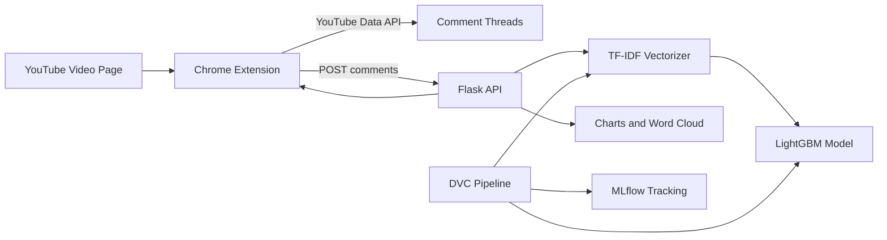

# SentiSync

[](https://github.com/ethanvillalovoz/sentisync/actions/workflows/ci.yml)
[](https://www.python.org/)
[](LICENSE)

Real-time YouTube comment sentiment analysis with a Chrome extension, Flask inference API, LightGBM model, DVC pipeline, MLflow experiment tracking, Docker, and optional AWS deployment.

SentiSync turns a YouTube video page into a lightweight comment-intelligence dashboard: it fetches comments through the YouTube Data API, sends them to a Flask backend, predicts sentiment with a TF-IDF + LightGBM model, and renders summary metrics, sentiment distribution, trend charts, word clouds, and top comments in the browser extension popup.

## Demo


## What This Project Demonstrates

- Chrome extension frontend for YouTube comment collection and visualization.
- Flask API for sentiment inference and chart generation.
- TF-IDF feature extraction with a trained LightGBM classifier.
- DVC pipeline for data ingestion, preprocessing, model training, evaluation, and registration.
- MLflow experiment logging for model comparison and reproducibility.
- Dockerized backend with optional AWS ECR/EC2 deployment through GitHub Actions.

## Architecture



## Repository Structure

```text
sentisync/
|-- flask_app/                  # Flask inference API and visualization endpoints
|-- yt-chrome-plugin-frontend/  # Manifest V3 Chrome extension
|-- src/                        # DVC pipeline scripts for data/model workflows
|-- notebooks/                  # Experiment notebooks and comparison artifacts
|-- docs/examples/              # Screenshots and deployment examples
|-- tests/                      # Backend smoke tests
|-- dvc.yaml                    # Reproducible ML pipeline definition
|-- params.yaml                 # Pipeline and model parameters
|-- Dockerfile                  # Backend container
|-- requirements-api.txt        # Flask API runtime dependencies
|-- requirements.txt            # DVC and MLflow pipeline dependencies
|-- requirements-experiments.txt # Optional notebook dependencies
|-- lgbm_model.pkl              # Trained LightGBM model artifact
|-- tfidf_vectorizer.pkl        # Trained TF-IDF vectorizer artifact
`-- setup.py
```

## Quick Start

Create a Python environment and install dependencies:

```bash
git clone https://github.com/ethanvillalovoz/sentisync.git
cd sentisync

python -m venv .venv
source .venv/bin/activate
python -m pip install --upgrade pip
pip install -r requirements-api.txt
python -m nltk.downloader stopwords wordnet
```

If you want to run the full DVC and MLflow pipeline, install the pipeline dependencies:

```bash
pip install -r requirements.txt
```

If you want to run the historical experiment notebooks, install the optional experiment dependencies:

```bash
pip install -r requirements-experiments.txt
```

On macOS, LightGBM inference may also require the OpenMP runtime:

```bash
brew install libomp
```

Run the Flask backend:

```bash
python flask_app/app.py
```

The API runs on `http://localhost:8080` by default.

## Chrome Extension Setup

1. Copy the example config:

   ```bash
   cp yt-chrome-plugin-frontend/config.js.example yt-chrome-plugin-frontend/config.js
   ```

2. Edit `yt-chrome-plugin-frontend/config.js`:

   ```js
   const CONFIG = {
     API_KEY: "your-youtube-data-api-key",
     API_URL: "http://localhost:8080"
   };
   ```

3. Open Chrome and go to `chrome://extensions`.
4. Enable Developer Mode.
5. Select "Load unpacked" and choose `yt-chrome-plugin-frontend/`.
6. Open a YouTube video page and launch the SentiSync extension.

## API Endpoints

| Endpoint | Method | Purpose |
| --- | --- | --- |
| `/health` | `GET` | Machine-readable service health check |
| `/predict` | `POST` | Predict sentiment for a list of comments |
| `/predict_with_timestamps` | `POST` | Predict sentiment while preserving comment timestamps |
| `/generate_chart` | `POST` | Generate sentiment distribution pie chart |
| `/generate_wordcloud` | `POST` | Generate a word cloud from comments |
| `/generate_trend_graph` | `POST` | Generate sentiment trend visualization over time |

Example prediction request:

```bash
curl -X POST http://localhost:8080/predict \
  -H "Content-Type: application/json" \
  -d '{"comments":["This video is awesome","The explanation was confusing"]}'
```

## Docker

Build and run the backend image:

```bash
docker build -t sentisync-backend .
docker run --rm -p 8080:8080 --name sentisync-backend sentisync-backend
```

## Reproducing The ML Pipeline

The DVC pipeline is defined in `dvc.yaml`:

```bash
pip install -r requirements.txt
dvc repro
dvc dag
```

Main stages:

1. `data_ingestion`: download and split the source sentiment dataset.
2. `data_preprocessing`: normalize and lemmatize comments.
3. `model_building`: train the TF-IDF + LightGBM model.
4. `model_evaluation`: log metrics and artifacts to MLflow.
5. `model_registration`: register the selected model from MLflow metadata.

Set `MLFLOW_TRACKING_URI` in your shell or `.env` file when using a remote MLflow tracking server.

## Verification

Run the same checks used by CI:

```bash
python -m py_compile \
  flask_app/app.py \
  src/data/data_ingestion.py \
  src/data/data_preprocessing.py \
  src/model/model_building.py \
  src/model/model_evaluation.py \
  src/model/register_model.py

python -m unittest discover tests
docker build -t sentisync-backend .
```

## AWS Deployment

GitHub Actions includes a manual deployment path for AWS ECR + EC2. To use it:

1. Configure repository secrets:
   - `AWS_ACCESS_KEY_ID`
   - `AWS_SECRET_ACCESS_KEY`
   - `AWS_REGION`
   - `ECR_REPOSITORY_NAME`
2. Register a self-hosted runner on the EC2 instance that should run the backend.
3. Run the `CI` workflow manually with `deploy=true`.

Normal pushes and pull requests run tests and Docker build only. Deployment is intentionally manual so public contributions do not attempt to use private infrastructure.

## Notes

- `yt-chrome-plugin-frontend/config.js` is ignored by Git so API keys and deployment URLs stay local.
- The included model artifacts let the Flask API run immediately after dependency installation.
- The notebooks are preserved as experiment records; the DVC scripts are the reproducible pipeline entry points.

## License

This project is released under the [MIT License](LICENSE).
