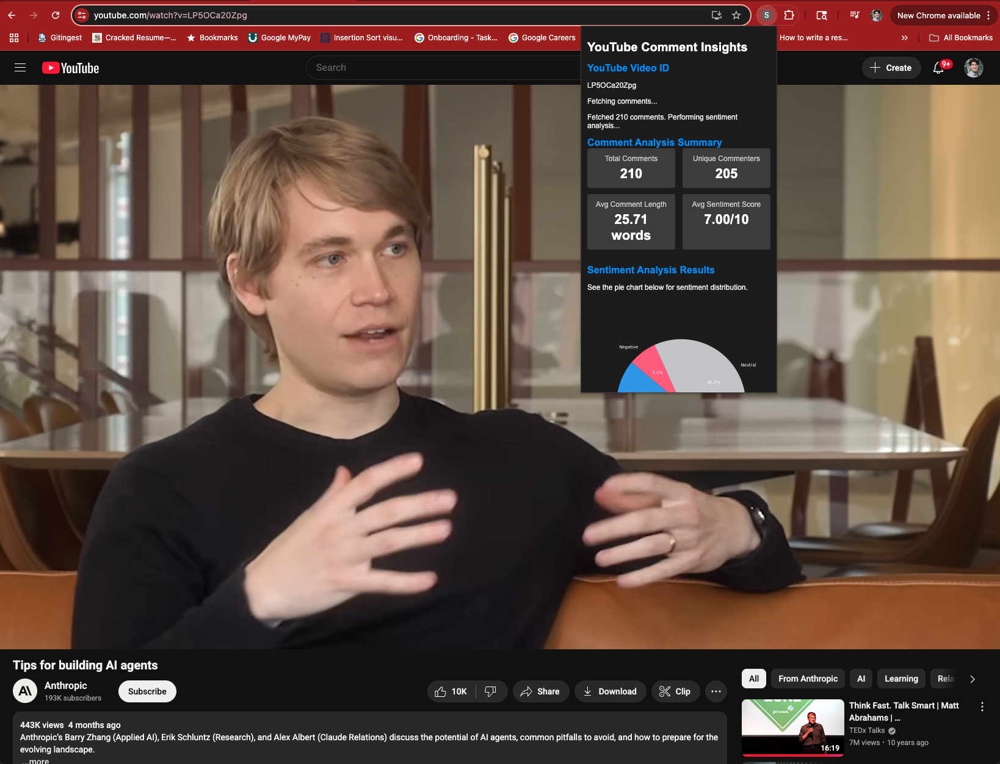
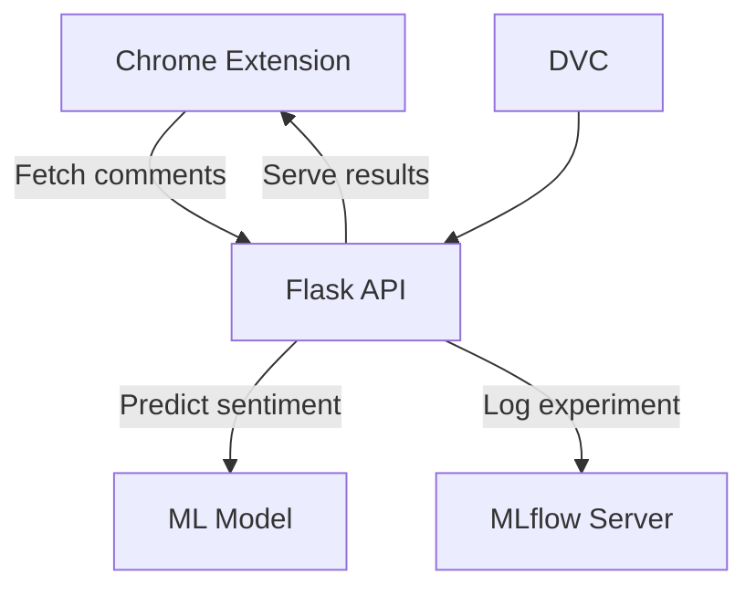

# SentiSync: Real-Time YouTube Sentiment Analysis

Real-time YouTube sentiment analysis with a Chrome Extension and end-to-end MLOps pipeline using Flask, MLflow, DVC, Docker, and AWS.

---

## 🚀 Project Goals

- Provide instant sentiment analysis for YouTube comments via a Chrome Extension.
- Enable reproducible machine learning workflows with DVC and MLflow.
- Deploy scalable backend services using Docker and AWS.
- Demonstrate modern MLOps and cloud deployment best practices.

---

## 🖼️ What Does It Look Like?

- **Chrome Extension:** Fetches YouTube comments and displays sentiment insights.
- **Backend API:** Serves predictions and visualizations.
- **MLflow Dashboard:** Tracks experiments and model metrics.
-  <!-- Add your own screenshot here -->

---

## 🛠️ Prerequisites

- Python 3.11+
- Node.js v12+ (for Chrome extension development)
- Docker
- AWS account (EC2, ECR setup)
- Chrome browser (for extension)
- [MLflow Tracking Server](https://mlflow.org/docs/latest/tracking.html) (optional, for experiment logging)

---

## ⚡ Quickstart

```sh
conda create -n sentisync python=3.11
conda activate sentisync
pip install -r requirements.txt
```

- Download and configure AWS CLI: [AWS CLI Install Guide](https://docs.aws.amazon.com/cli/latest/userguide/getting-started-install.html)
- Configure AWS credentials:
  ```sh
  aws configure
  ```
- Initialize DVC:
  ```sh
  pip install --upgrade dvc
  dvc init
  dvc repro
  dvc dag
  ```
- Run backend locally:
  ```sh
  python flask_app/app.py
  ```
- Build and run Docker image:
  ```sh
  docker build -t sentisync-backend .
  docker run -d -p 8080:8080 --name=cnncls sentisync-backend
  ```

---

## ⚙️ Configuration / Environment Variables

- **AWS Credentials:**  
  Set via GitHub secrets for CI/CD:
  - `AWS_ACCESS_KEY_ID`
  - `AWS_SECRET_ACCESS_KEY`
  - `AWS_REGION`
  - `ECR_REPOSITORY_NAME`
- **MLflow Tracking URI:**  
  Set in `.env` or as an environment variable:
  ```
  MLFLOW_TRACKING_URI=http://<your-mlflow-server>:5000/
  ```
- **Chrome Extension API URL:**  
  Set in `yt-chrome-plugin-frontend/config.js`:
  ```js
  API_URL: "http://<your-ec2-public-ip>:8080/"
  ```

---

## 📁 Directory Structure

```
sentisync/
├── flask_app/                # Backend Flask API
├── yt-chrome-plugin-frontend # Chrome extension frontend
├── src/                      # Data preprocessing & model scripts
├── notebooks/                # Jupyter notebooks for experiments
├── data/                     # Datasets
├── .github/workflows/        # CI/CD workflows
├── Dockerfile                # Backend Docker build
├── requirements.txt          # Python dependencies
├── dvc.yaml, dvc.lock        # DVC pipeline configs
├── README.md                 # Project documentation
└── docs/                     # Additional documentation (recommended as README grows)
```

---

## 🚀 Deployment & Setup Guide

### Environment Setup

```sh
conda create -n youtube python=3.11 -y
conda activate youtube
pip install -r requirements.txt
```

### DVC

```sh
dvc init
dvc repro
dvc dag
```

### AWS CLI

```sh
aws configure
```

### API Demo (using Postman)

- Endpoint: `http://localhost:5000/predict`
- Example JSON payload:
  ```json
  {
      "comments": ["This video is awesome! I loved a lot", "Very bad explanation. poor video"]
  }
  ```

### Chrome Extension

- Load your extension at `chrome://extensions`

### How to get YouTube API key from GCP

- [YouTube API Key Tutorial](https://www.youtube.com/watch?v=LLAZUTbc97I)

---

### AWS CI/CD Deployment with GitHub Actions

#### 1. Login to AWS Console

#### 2. Create IAM User for Deployment

- **Access Needed:**
  - EC2 (virtual machine)
  - ECR (Elastic Container Registry for Docker images)
- **Policies:**
  - `AmazonEC2ContainerRegistryFullAccess`
  - `AmazonEC2FullAccess`

#### 3. Create ECR Repository

- Save the URI (example):  
  `315865595366.dkr.ecr.us-east-1.amazonaws.com/youtube`

#### 4. Create EC2 Machine (Ubuntu)

#### 5. Install Docker on EC2

```sh
sudo apt-get update -y
sudo apt-get upgrade
curl -fsSL https://get.docker.com -o get-docker.sh
sudo sh get-docker.sh
sudo usermod -aG docker ubuntu
newgrp docker
```

#### 6. Configure EC2 as Self-Hosted Runner

- Go to GitHub: `Settings > Actions > Runners > New self-hosted runner`
- Choose OS and run setup commands on EC2

#### 7. Setup GitHub Secrets

```text
AWS_ACCESS_KEY_ID=
AWS_SECRET_ACCESS_KEY=
AWS_REGION=us-east-1
AWS_ECR_LOGIN_URI=566373416292.dkr.ecr.ap-south-1.amazonaws.com
ECR_REPOSITORY_NAME=simple-app
```

---

## ❓ FAQ / Troubleshooting

- **Q:** API returns "Error fetching sentiment predictions"  
  **A:** Check Docker logs for missing model files or NLTK data. Ensure `lgbm_model.pkl` and `tfidf_vectorizer.pkl` are present and `RUN python3 -m nltk.downloader stopwords` is in your Dockerfile.

- **Q:** Chrome extension can't connect to backend  
  **A:** Verify EC2 security group allows inbound traffic on port 8080. Confirm API URL in `config.js` matches your EC2 public IP and port.

- **Q:** DVC or MLflow not working  
  **A:** Ensure remote tracking URIs and credentials are set correctly in `.env`.

---

## 🏗️ Architecture



---

## 🤝 Contributors

See [CONTRIBUTING.md](CONTRIBUTING.md) for guidelines on how to get involved.

---

## 📝 Issue & PR Templates

- Bug, feature, and idea templates are available in `.github/ISSUE_TEMPLATE/`.
- PR template is available in `.github/PULL_REQUEST_TEMPLATE.md`.

---

## 📚 Further Documentation

As the project grows, move extended guides and technical docs to the `docs/` folder.

---

## 🏆 SOLID Principles

This project aims for maintainability and scalability by following SOLID principles in code structure.

---

## 📈 Future Goals

- Add more ML models and experiment tracking.
- Improve frontend UX and visualizations.
- Expand deployment options (Kubernetes, serverless).
- Add user authentication and personalization.

---

Feel free to open issues or PRs for suggestions, improvements, or bug reports. Your feedback is valuable!